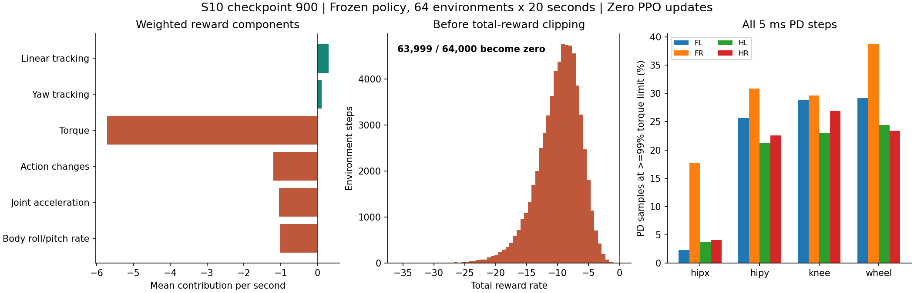

# S10 第 900 轮：站立失败与训练信号诊断

## 结论

后续无策略小扰动检查已发现更基础的 **5 ms PD 离散稳定性问题**，应优先处理控制更新，再重新判断奖励与探索配方。见 [控制稳定性与改进建议](S10_PD_AND_RETRAIN_RECOMMENDATION_20260915.md)。下文保留原第 900 轮采样事实。

当前模型不能维持站姿。新增采样确认：**64,000 个环境步中，63,999 个总奖励被截为零（99.9984%）**。原配置下的惩罚、动作探索和控制响应组合，使几乎所有采样动作都得到相同的零即时奖励。这是继续训练前应优先处理的问题，不能仅凭这些结果把原因归结为 Kp=80。

本次只分析已有录像、日志和第 900 轮模型，并进行一次原配置的随机动作采样。没有重跑运动能力测试、修改训练参数或执行 PPO 更新。

## 1. 录像里的失败发生在零命令阶段

已有 MuJoCo 轨迹从模型默认站姿开始，并非从趴地姿态起身。前两秒的指令为零：

| 时间 | 机身高度 | 机身倾角（竖直向上为 0°） |
| --- | ---: | ---: |
| 0.5 s | 0.407 m | 1.13° |
| 1.0 s | 0.416 m | 1.97° |
| 1.5 s | 0.393 m | 9.38° |
| 2.0 s | 0.265 m | 62.36° |
| 2.36 s | 0.113 m | 155.92°，底盘触地 |

2.0 秒的状态是前进指令施加前的结果。机器人短暂保持了初始姿态，但在零命令阶段已经失稳；后面的大部分录像是翻倒后的连续仿真。无需再用前进、转向和停车测试证明失败。

来源：已有 `artifacts/s10-scratch1000-20260915/mujoco_trace.npz`，离线分析见 [failure_offline.json](evidence/s10-diagnosis900-20260915/failure_offline.json)。

## 2. 新增采样的方法与边界

- 只加载 `model_900.pt`；模型权重在采样结束后逐项比较，完全不变。
- 64 个环境，每环境 20 秒，共 64,000 个策略步样本、256,000 个 5 ms PD 子步样本。
- 从保存的训练配置完整恢复；配置比较确认只有 `num_envs` 从 4096 改为 64。保留混合地形、课程、随机命令、域随机化、延迟和观测噪声。
- 使用策略的高斯随机动作，观测当前训练探索下的表现；初始化新的物理环境及课程状态，**不是第 900 轮训练物理状态的精确重放**。
- 在原有奖励函数和力矩函数的调用处采集结果，各原函数仍只执行一次。奖励及终止状态在 reset 前记录，PD 力矩覆盖所有子步。
- PPO 更新为 0；没有参数 A/B，没有重新训练。20 秒采样内出现 454 次底盘接触终止、0 次超时，终止后按原训练流程重置。

完整数据：[summary.json](evidence/s10-diagnosis900-20260915/summary.json)、[实际配置](evidence/s10-diagnosis900-20260915/config.json)。

## 3. 奖励几乎失去了区分

| 指标 | 实测 |
| --- | ---: |
| 总奖励为负、随后被截为零 | 63,999 / 64,000，99.9984% |
| 获得正奖励的样本 | 1 |
| 截断前总奖励率中位数 | -9.363 / s |
| 线速度与偏航跟踪奖励率之和 | +0.421 / s |
| 扭矩惩罚率 | -5.720 / s |
| 动作变化惩罚率 | -1.203 / s |
| 关节加速度惩罚率 | -1.048 / s |
| 机身横滚/俯仰角速度惩罚率 | -1.004 / s |

这里的奖励率是各采样步的加权奖励除以 20 ms，再按样本平均；与训练日志按回合归一化后求均值的统计口径不同。

在同一批数据中，仅保留机身倾角小于 15° 的 24,799 个样本，仍有 **99.9960%** 奖励为零。开头一秒的 3,200 个样本全部为零。奖励归零并不只出现在大幅翻倒时。

扭矩是最大的惩罚来源，但其他三个主要惩罚项各自也超过两项跟踪奖励之和，因此不能只盯着扭矩权重。原实现 `only_positive_rewards=True` 将负总奖励截为零，使许多程度不同的失败得到同一个即时奖励。

训练日志与此一致：截至 900 轮，最高平均回合回报仅 0.00128；第 900 轮为 0，平均回合长度 2.44 秒。第 301–900 轮记录的学习率一直为 1e-5，探索标准差继续增长。低 value loss 在这种奖励接近零的环境中不能作为“已经学好”的证据。

PPO 损失还保留 `entropy_coef=0.005` 的熵奖励，它鼓励随机探索；在任务奖励几乎不能区分动作时，这与探索标准差持续增长相符。价值估计等仍可能产生更新，不能把零即时奖励等同于所有梯度为零。本次未用对照实验量化熵项、Kp 或单个奖励项的独立因果贡献。

## 4. 探索和力矩的物理尺度

| 关节组 | 随机动作引起的目标标准差（1σ） | 每个电机的 PD 力矩饱和比例范围 |
| --- | --- | ---: |
| hipx | 0.179–0.190 rad，约 10.3–10.9° | 2.28%–17.63% |
| hipy | 0.356–0.367 rad，约 20.4–21.0° | 21.24%–30.88% |
| knee | 0.362–0.379 rad，约 20.7–21.7° | 23.03%–29.68% |
| wheel | 7.37–7.69 rad/s | 23.40%–38.67% |

1σ 是相对于当前策略均值的目标扰动，不是关节实际运动幅度，也不是目标限幅。力矩饱和定义为实际输出达到模型力矩上限的至少 99%，统计包含所有 5 ms 控制子步。

腿部力矩惩罚合计约 -5.542 / s，占全部扭矩惩罚的 **96.9%**；轮子约 -0.177 / s。轮子虽然也经常饱和，当前扭矩奖励主要受腿部支配。

实际 `hipy/knee` 目标每个策略周期的变化量中位数约 0.432 / 0.467 rad，轮速目标变化量中位数约 9.13 rad/s。此统计包含策略均值变化、探索和 reset 后从零上一动作开始的跳变。没有样本触发 raw action 的 ±100 裁剪；实际生效的限制主要是后端力矩裁剪。

已有确定性 MuJoCo 回放也失稳，因此不能把最终模型的失败全部归因于评估时添加的探索噪声。



## 5. 下一步的优先级

1. 先处理探索幅度、主要惩罚项和总奖励截断的组合，让策略能分辨动作好坏。
2. 当前证据不支持沿用原配置继续堆训练轮数，也不足以单独决定降低 Kp。准备阶段的零动作 PD 站立已通过，优先关注策略学习信号及目标跳变。
3. 后续若修改配方，先以短时站姿保持、奖励分布及力矩占用作为验收，再恢复运动能力评估。新训练预算及参数 A/B 需要另行确定。

## 复现与验证

脚本：[diagnose_s10.py](../legged_gym/scripts/diagnose_s10.py)。在原服务器镜像中执行；已有 `diagnosis_900` 目录时会拒绝覆盖：

```bash
python legged_gym/scripts/diagnose_s10.py --task s10 --headless \
  --load_run Sep15_08-33-31_scratch_1000_20260915 --checkpoint 900 --num_envs 64
python legged_gym/scripts/diagnose_s10.py --self-check
```

自检已通过；另从保存的轨迹重建了扭矩奖励、动作变化奖励和最终截断奖励，均与原环境实际输出一致。配置仅环境数变化的核对通过，见 [analysis.json](evidence/s10-diagnosis900-20260915/analysis.json)。

原始轨迹和运行日志保存在本地 `artifacts/s10-diagnosis900-20260915/`；服务器为原训练目录下的 `diagnosis_900/`，日志为 `/data/him-runtime/s10-diagnose900-20260915.log`。采样脚本输出完整 `DIAGNOSIS_RESULT` 并写完结果；外围 SSH 命令的退出码转发发生引号错误，与已完成的采样及数据核验分开记录，没有因此重跑采样。
