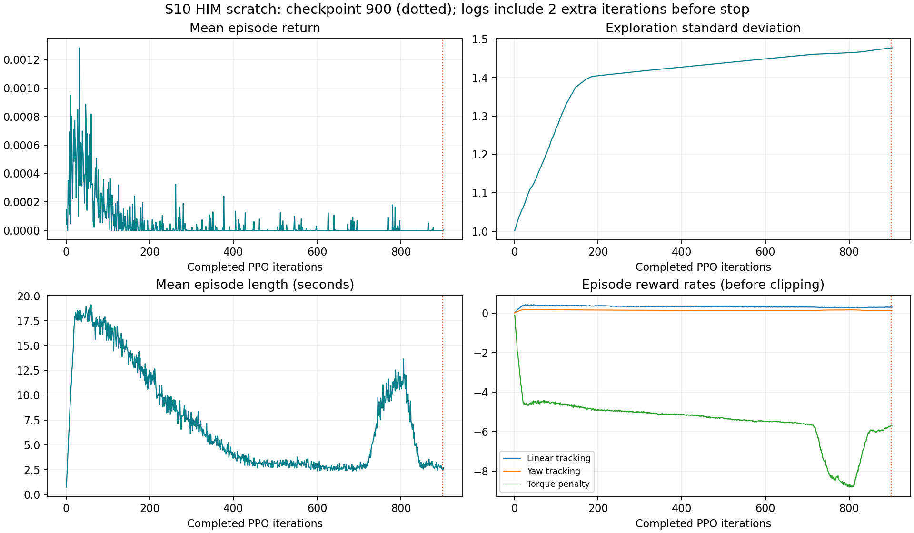
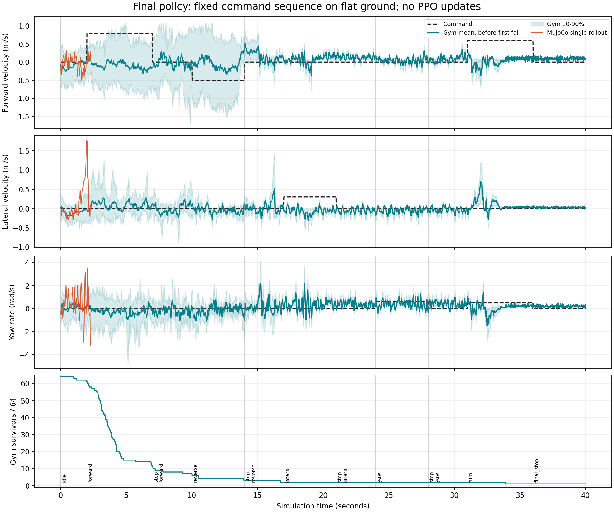

# S10 HIM 从零训练：第 900 轮结果

## 结论与停止状态

训练已停止，保留并评估 `model_900.pt`。这个模型尚未学会稳定站立、速度跟踪和停车：64 个 Gym 环境中只有 1 个在 40 秒内未出现底盘触地；MuJoCo 在 2.36 秒时底盘触地。

用户最初批准从零训练 1000 轮，随后要求保存第 900 轮后停止。停止控制发生了失误：容器内检查在 checkpoint 写完约 32 ms 后确认文件可读，但容器内信号没有终止训练。随后从宿主机执行 `docker kill`，日志最终完成到 **902 轮**。额外两轮未保存为模型；本报告的策略评估只使用第 900 轮 checkpoint。

- 第 900 轮文件完成：2026-09-15 **19:12:20.522**，北京时间。
- 容器确认停止：**19:13:03.102**；`Running=false`、`ExitCode=137`、`OOMKilled=false`。这是主动终止，不是显存溢出。
- 停止记录与实际容器状态：[stop_verification.json](evidence/s10-scratch900-20260915/stop_verification.json)。

## Git 与运行依据

- 准备工作已提交：`e60663c` — `Prepare S10 HIM integration and verified zero-PPO runtime`。
- 训练代码已提交：`a0160fb62988ead9f157e99d1cccc39e52e7e1ec` — `Save initial and periodic S10 training checkpoints`。
- 训练前新增 `model_0.pt` 保存、每 100 轮保存 checkpoint；没有在训练中修改奖励或 HIM/PPO 算法。
- 训练源代码通过 `git archive` 传到服务器。SSH 使用别名 `paratera-rl-new`。
- 容器：`him-s10-scratch1000-20260915`，已停止；名称保留最初的 1000 轮计划。
- 目录：`/data/HIMLoco-for-Go2W/logs/S10_HIM/Sep15_08-33-31_scratch_1000_20260915`。
- 配置：scratch、seed 1、4096 环境、每环境每轮 48 步、20 ms 策略周期、5 ms PD 子步。沿用混合地形、课程学习、域随机化、观测噪声和动作延迟。
- 启动日志确认 GPU PhysX、`cuda:0`、GPU pipeline enabled。

原始启动命令（已执行记录，勿重复启动）：

```bash
docker compose run -d --name him-s10-scratch1000-20260915 him \
  python legged_gym/scripts/train.py --task s10 --headless \
  --initialization scratch --max_iterations 1000 --num_envs 4096 \
  --seed 1 --run_name scratch_1000_20260915
```

冻结配置：[config.json](evidence/s10-scratch900-20260915/config.json)。初始模型、启动记录、完整日志和原始 TensorBoard 标量均已备份到本地 `artifacts/s10-scratch1000-20260915/`。

## 第 900 轮模型核验

| 项目 | 结果 |
| --- | --- |
| 保存的迭代号 | 900 |
| checkpoint 累计环境步 | 176,947,200 = 900 × 4096 × 48 |
| checkpoint 累计训练计时 | 9,499.05 秒，约 2 小时 38 分 |
| 初始模型的两套优化器状态 | 均为空，未加载预训练模型 |
| PPO / HIM 估计器 Adam 更新次数 | 均为 18,000 |
| 两套优化器最后学习率 | 均为 1e-5 |
| 模型参数 | 全部为有限值 |
| 导出策略与原策略最大输出差 | 2.98e-7 |
| 本次评估新增 PPO 更新 | 0 |

证据：[training_verification.json](evidence/s10-scratch900-20260915/training_verification.json)、[summary.json](evidence/s10-scratch900-20260915/summary.json)。训练日志包含额外完成的 901、902 轮；它们与第 900 轮模型的累计步数分开记录。

## 学习曲线

第 900 轮对应 TensorBoard step 899：平均回合奖励 **0.0**、平均回合长度 **2.44 秒**、平均探索标准差 **1.4766**。整个已记录运行的平均回合奖励最高仅约 **0.00128**。

该轮奖励分项的每秒均值：扭矩惩罚 **-5.688**，线速度跟踪 **+0.285**，偏航跟踪 **+0.120**。这些分项在总奖励截断之前记录，且按各回合实际时长归一化。`only_positive_rewards=True` 将负总奖励截为零。证据指向探索幅度、S10 控制增益与奖励惩罚尺度的组合压低了有效学习信号；本次没有用额外对照实验确认各因素的独立贡献。

精确值：[checkpoint_metrics.json](evidence/s10-scratch900-20260915/checkpoint_metrics.json)。下图保留全部 902 轮日志，虚线标记所评估的第 900 轮。



## 运动评估

评估使用策略均值，不采样探索噪声。Gym 为 64 个平地环境，关闭域随机化、延迟和观测噪声，保留原环境的关节位置与根部速度随机初始化。40 秒命令序列覆盖待机、前进、后退、横移、偏航、弧线运动及各段停车。配置见 [evaluation_config.json](evidence/s10-scratch900-20260915/evaluation_config.json)。

Gym 以底盘接触合力大于 1 N 作为失败事件。**63/64 个环境至少出现一次该事件**，累计自动重置 366 次。速度统计只使用每台机器人首次失败前的样本，失败后的重置不会计为恢复成功。

下表取各命令段最后 1 秒；单位依次为 m/s、m/s、rad/s。后段只剩极少数幸存样本，不能代表整体成功。

| 命令段 | 目标 vx / vy / yaw | 实测均值 vx / vy / yaw | 有效 50 Hz 样本数 |
| --- | --- | --- | ---: |
| 前进 | 0.8 / 0 / 0 | -0.194 / 0.094 / -0.122 | 689 |
| 前进后停车 | 0 / 0 / 0 | -0.036 / 0.102 / -0.337 | 365 |
| 后退 | -0.5 / 0 / 0 | 0.005 / -0.080 / -0.053 | 198 |
| 横移 | 0 / 0.3 / 0 | 0.173 / -0.052 / 0.453 | 100 |
| 偏航 | 0 / 0 / 0.6 | 0.061 / -0.047 / 0.309 | 100 |
| 最终停车 | 0 / 0 / 0 | 0.105 / 0.028 / 0.223 | 50 |

前进段 vx 的 RMSE 为 **1.131 m/s**。首次失败前的 50 Hz 采样还显示：轮关节速度最高 **112.98 rad/s**（模型声明限值 65.5），腿关节最高 **35.08 rad/s**（声明限值 25.76）；四个轮电机在约 **46.8%–67.6%** 的样本中达到至少 99% 扭矩限幅。这里是采样峰值和最后 PD 子步扭矩，未声称覆盖所有 5 ms 子步峰值。

MuJoCo 使用官方平地场景、默认站姿、同一完整 HIM 导出策略和同一命令序列，单次连续运行 40 秒、不重置。底盘接触力首次超过 1 N 的时间为 **2.36 秒**；8 项仿真警告计数均为 0。Gym 与 MuJoCo 的初态、接触参数和统计样本量不同，这次用于检查同一策略的运动与部署表现。



## 产物与复现

- [40 秒 MuJoCo 回放](../artifacts/s10-scratch1000-20260915/mujoco_900.mp4)：字幕给出命令，并标明 2.36 秒后的运动属于失败后的连续仿真。
- [第 900 轮 checkpoint](../artifacts/s10-scratch1000-20260915/model_900.pt)。
- [完整 HIM TorchScript 策略](../artifacts/s10-scratch1000-20260915/policy.pt) 与 [部署元数据](evidence/s10-scratch900-20260915/policy.json)。
- 原始轨迹：本地 artifact 目录的 `gym_trace.npz`、`mujoco_trace.npz`。
- 服务器评估目录：上述训练目录下的 `evaluation_900/`；评估容器 `him-s10-eval900-20260915` 已正常退出，状态码 0。

评估入口为 `legged_gym/scripts/evaluate_s10.py --task s10 --headless --load_run Sep15_08-33-31_scratch_1000_20260915 --checkpoint 900 --num_envs 64`。该程序拒绝覆盖既有评估目录。渲染入口为 `deploy/render_s10.py`，读取保存的轨迹，不重新训练。物理仿真使用 MuJoCo 3.2.3，录像用本地 MuJoCo 3.11.0 回放所记录的 qpos/qvel。

核验完成：配置完整恢复、统计逻辑的已知输入检查、实际 Gym/MuJoCo 零 PPO 评估、JIT 输出一致性、40 秒录像渲染与图像检查。生成图表时使用 `D:\Anaconda\python.exe -s`，避开用户 site-packages 中 NumPy 2 与现有 Matplotlib 的 ABI 冲突，没有改动该 Python 环境。

## 后续选择

已补充 [第 900 轮站立失败与训练信号诊断](S10_HIM_DIAGNOSIS900_20260915.md)：原配置下零 PPO 采样 64,000 个环境步，99.9984% 总奖励被截为零；后续工作应优先处理学习信号与探索尺度。

初始化已确定为 scratch，本次模型保存到 900。后续应根据上述诊断调整探索与奖励配方；任何 A/B 对比和新训练预算均需另行确认。本次没有使用子代理，也没有进行 A/B 测试。
