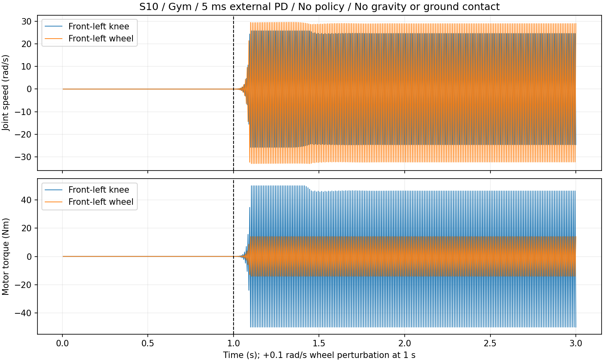

# S10：先修复 PD 离散稳定性，再验证学习配方

## 结论更新

**当前 5 ms 外算 PD 在 S10 上存在确定的动态稳定性问题。应把控制更新的修复排在奖励和探索调参之前。** 此结论来自固定目标、无神经网络、无随机探索的小扰动检查。

上一轮测出的 99.9984% 奖励归零仍成立，但其中的高扭矩、高加速度不应全部解释为探索或奖励权重不合适；数值振荡也在制造这些代价。现在没有依据同时下调一组奖励权重，然后期待它们掩盖控制问题。

本次没有修改正式训练参数，没有加载策略进行新的运动评估，也没有执行 PPO。

用户随后授权直接完成 2.5 ms 零 PPO 对照，并创建新任务进行短训。**2.5 ms 对照现已通过**，数据见下文；短训按交接 prompt 在独立新任务执行，预算最多 200 轮。

## 1. M20 和 S10 的差异确实影响控制

来源为本地 `rl_training/deep_robotics_model/M20/urdf/M20.urdf`、本仓库 S10 URDF，以及 `rl_training/source/rl_training/rl_training/assets/deeprobotics.py` 的执行器配置。数值是模型/配置值，不是实机重新辨识结果。

| 项目 | M20 | S10 |
| --- | ---: | ---: |
| URDF 总质量 | 34.4914 kg | 18.9874 kg |
| 单段腿长（膝/轮关节原点的竖直分量） | 0.25 m | 0.18 m |
| 前左轮质量 | 0.638 kg | 0.587952 kg |
| 前左轮绕关节轴的惯量 | 0.002853 kg·m² | 0.002003 kg·m² |
| 轮执行器额外 armature | 0.00243216 kg·m² | 0 |
| 腿 Kp / Kd | 80 / 2 | 80 / 2 |
| 轮 Kp / Kd | 0 / 0.6 | 0 / 0.6 |
| 腿/轮力矩限幅 | 76.4 / 21.6 Nm | 50 / 14 Nm |

`armature` 表示折算到关节侧的额外转动惯量。M20 的轮惯量、附加惯量和 S10 不同，同样的 Kd 和采样周期会产生不同的制动响应；膝和轮的动态还相互耦合。不能只用总质量或腿长比例缩放 Kp/Kd，也不能把 M20 的 armature 数字当作 S10 的真实参数复制。

另一个区别是奖励来源：当前 HIM S10 继承 Go2W 的扭矩权重 -5e-4；本地 M20 配方腿扭矩权重为 -2.5e-5，轮扭矩项为 0，跟踪权重也不同。当前 HIM 并不是完整的 M20 配方；这个差异提示需校准实际贡献，但不能据此机械替换权重。

## 2. 无训练测试：固定目标也会振荡

测试保持原 S10 资产、80/2 与 0/0.6、50/14 Nm 限幅、5 ms 外算 PD。16 个实例分别对应 16 个关节：默认关节目标与零轮速目标始终不变，在 1 秒时只给对应关节增加 **0.1 rad/s** 速度；持续到 3 秒，统计最后一秒。没有 actor、噪声、延迟或域随机化。

### 离地、无重力的小扰动响应

离地场景排除了地面摩擦、接触求解以及站姿指令的影响，检验控制器对机器自身关节耦合的响应。

| 引擎 | 膝关节速度 RMS | 轮速度 RMS | 膝力矩饱和比例 | 轮力矩饱和比例 |
| --- | ---: | ---: | ---: | ---: |
| Gym / PhysX | 24.53–24.60 rad/s | 30.42–30.70 rad/s | 50% | 100% |
| MuJoCo 3.2.3 | 24.53–24.60 rad/s | 30.42–30.70 rad/s | 50% | 100% |

16 种单关节扰动均触发持续振荡。小扰动本应衰减，却被控制循环放大，最终受力矩裁剪限制。两种引擎得到接近的响应，说明问题涉及当前显式 PD 的离散实现和模型动力学，不能只归因于某一种接触求解器。

MuJoCo 默认姿态质量矩阵给出的无接触局部离散线性化最大模态幅值倍率约为 **1.5297 / 步**；大于 1 的模式与实测增长相符。这是固定姿态局部分析，不是所有姿态的稳定性保证。

### 有重力的平地检查

在 Gym 的 16 个相同站姿实例上做同样小扰动，15 个实例末秒最大关节速度约 0.09–0.12 rad/s；前左 hipx 扰动的实例则激发持续振荡，末秒峰值 **38.80 rad/s**。其机身高度仍约 0.430 m。

因此，“高度正常、没有 NaN、零动作能静止”不足以验收控制环。站立接触可以抑制部分模式，抬腿或扰动仍可能激发它们。

机器可读证据：[Gym 离地](evidence/s10-pd-followup/gym-air-5ms.json)、[MuJoCo 离地](evidence/s10-pd-followup/mujoco-air-5ms.json)、[Gym 平地](evidence/s10-pd-followup/gym-stand-5ms.json)。原始逐物理步轨迹在 `artifacts/s10-pd-followup/`。

### 已授权的 2.5 ms 对照结果

复用以上 5 ms 基线，对每个引擎/场景核对配置：只改变 `dt` 和 `decimation`，20 ms 策略周期、初态设置、扰动和增益不变。没有运行策略或优化器。

| 场景 | 5 ms 末秒最大关节 RMS | 2.5 ms 末秒最大关节 RMS | 2.5 ms 末秒力矩饱和 |
| --- | ---: | ---: | ---: |
| Gym 离地 | 30.6977 rad/s | 0.0000204 rad/s | 0 |
| MuJoCo 离地 | 30.7005 rad/s | 0.0000180 rad/s | 0 |
| Gym 平地 | 7.2580 rad/s | 0.0370 rad/s | 0 |

2.5 ms 平地 16 个实例的末秒最大关节速度均低于 0.083 rad/s，最终高度在 0.42203–0.42240 m。离地小扰动均衰减，之前的大幅高频振荡消失。这里验证的是所测默认姿态、小扰动和名义增益，不表示所有姿态、随机化或训练策略都已验证；平地轨迹记录的是高度与关节状态，未直接采集底盘接触力。

数据与配置检查：[timestep_comparison.json](evidence/s10-pd-followup/timestep_comparison.json)。MuJoCo 的局部线性化最大模态模长变为 1；其中包含不约束轮绝对角的中性位置模式，不能把这个数值解释成轮速不衰减。

## 3. 具体怎么处理

### 第一优先级：更快重算 PD，保持策略 50 Hz

首选候选是 **sim.dt=0.0025、decimation=8**，每个 2.5 ms 子步重新根据反馈算 PD。动作、历史、奖励积分的周期仍为 20 ms。

- 不能只把 PhysX 的内部 `substeps` 增加到 2：本仓库在 `gym.simulate()` 外面算力矩，这样仍然把旧力矩保持 5 ms，没有缩短反馈更新周期。
- 先保留 Kp/Kd、真实资产惯量和力矩限幅。降低 Kp 或给 S10 填入未经辨识的 M20 armature 会同时改变想要的物理响应。
- 更改 `decimation` 后须保持原动作延迟的物理分布：原来 0/1/2/3 个 5 ms 子步，即 0/5/10/15 ms；改成 2.5 ms 时应对应 0/2/4/6 子步。不能直接扩大到 `randint(0,8)` 而悄悄更改分布。
- MuJoCo 从新的导出元数据读取相同时间步。仿真的外算 PD 更新频率不等于已确认的真机固件内环频率；现有约 200 Hz SDK 状态反馈不能用来证明固件 PD 只运行 200 Hz。

本地旧 S10 项目有 2.5 ms 消除同类振荡的历史记录；本轮直接对照也已确认，2.5 ms 消除了所测案例的自激振荡，支持将其用于下一轮候选。短训前仍需检查完整随机化和策略采样。

MuJoCo 3.2.3 官方文档也指出，高增益或显式阻尼反馈可产生振荡，减小时间步是相关处理方式：[High-frequency vibration](https://mujoco.readthedocs.io/en/3.2.3/modeling.html#preventing-slip)。本项目通过 `data.ctrl` 传入已经计算的力矩，不能假定仅更换积分器就会自动把 Python 中的 PD 反馈变成隐式控制。

### 第二优先级：用从零策略重新标定探索，先不同时改一组奖励

第 900 轮的 actor 已经在异常动力学和几乎零奖励下训练，不能用它在修复后的表现决定新的初始配方。后续验证应重新初始化 actor、critic、HIM 估计器及优化器。

建议首个短训候选只额外把**初始**标准差设为：腿 0.3，轮 0.6。动作缩放仍为 hipx 0.125、hipy/knee 0.25、轮 5。

- 对应初始目标标准差：hipx 2.15°、hipy/knee 4.30°、轮 3 rad/s。
- 以名义增益、固定当前状态、忽略反馈变化和力矩裁剪估算，仅探索噪声带来的扭矩平方惩罚约 0.168 / s。它是选起点的数量级估算，不是仿真收益预测。
- 0.3/0.6 是待短训验证的工程起点，并非已证明最优的参数。标准差仍可学习，不在这轮增加硬上限或新的噪声调度器。

短训之前先在这一个候选上做零 PPO 采样，检查奖励分布与力矩占用。若仍几乎全为零，应停止并带回数据，而不是自动改多个奖励或开始训练。

### 暂不建议的改动

- 不直接恢复第 900 轮接着训练。
- 不先关闭 `only_positive_rewards`：只解除截断可能让“早点摔倒、早点结束负回报”变得有利。保留负奖励可以是一种配方，但必须连同终止语义一起设计，不能当作本轮已验证的单行修复。
- 暂时保留现有奖励权重、PPO、熵系数、网络、观测、命令和地形，先看修复后的真实代价。数值振荡消失后再决定哪些惩罚确实过强。

## 4. 下一任务

用户已要求直接创建新任务，按 [单一候选、从零 200 轮的交接 prompt](S10_PD_REPAIR_PILOT_PROMPT_20260915.md) 到服务器执行。先通过候选的奖励/力矩采样检查，最多训练 200 轮；本任务只完成零 PPO 控制对照。

测试脚本：[probe_s10_pd.py](../legged_gym/scripts/probe_s10_pd.py)。汇总自检通过，两个引擎和地面小扰动检查实际完成；脚本只写独立测试产物，没有修改正式环境配置。
